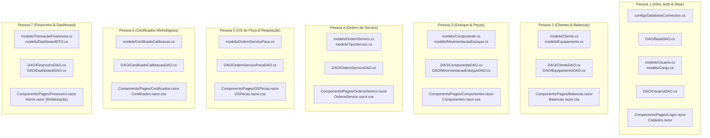

# Guia Técnico e Plano de Implementação Detalhado — Baltec PDS (7 Desenvolvedores)

Este documento detalha **arquivo por arquivo**, **método por método**, **tabela por tabela** e as responsabilidades de cada um dos **7 desenvolvedores** para a arquitetura com `/configs`, `/models` e `/DAO`, utilizando **MySQL** no projeto **Baltec PDS** (.NET 8 Blazor Interactive Server).

---

## 1. Padrão Arquitetural e Nomenclaturas

* **Localização das pastas na raiz do projeto:**
  - `configs/`
  - `models/`
  - `DAO/`
  - `Components/Pages/`
* **Biblioteca de Conexão MySQL:** `MySqlConnector` (versão 2.3+ ou compatível com .NET 8).
* **Injeção de Dependências:** Todos os DAOs devem ser registrados em [`Program.cs`](file:///home/master/Documentos/DEV/Baltec-PDS/Program.cs) como `AddScoped<TDAO>()`.

---

## 2. Detalhamento por Desenvolvedor

---

### **PESSOA 1 — Infraestrutura, Conexão MySQL, Segurança e Autenticação**

> **Objetivo Central:** Fornecer o mecanismo central de conexão com o MySQL, classe base de comandos, gerenciamento de credenciais e finalizar o fluxo de login/cadastro com persistência real.

#### Arquivos a Criar/Modificar:
1. `appsettings.json` (Modificar)
   - Adicionar chave `"ConnectionStrings": { "DefaultConnection": "Server=localhost;Database=baltec;User=root;Password=suasenha;" }`.
2. `Baltec.csproj` (Modificar)
   - Adicionar pacote NuGet: `<PackageReference Include="MySqlConnector" Version="2.3.7" />` e biblioteca de hash (ex: `BCrypt.Net-Next` ou usar `SHA256`).
3. `configs/DatabaseConnection.cs` (Criar)
   - **Namespace:** `Baltec.configs`
   - **Responsabilidade:** Ler string de conexão de `IConfiguration` e instanciar `MySqlConnection`.
   - **Métodos:**
     - `public MySqlConnection GetConnection()`: Retorna uma nova instância aberta ou pronta para abrir.
     - `public string GetConnectionString()`: Retorna a string pura.
4. `DAO/BaseDAO.cs` (Criar)
   - **Namespace:** `Baltec.DAO`
   - **Responsabilidade:** Fornecer métodos auxiliares protegidos para abrir conexões, criar comandos e evitar repetição de boilerplate ADO.NET.
5. `models/Cargo.cs` (Criar)
   - **Campos:** `int Id`, `string Nome`, `string? Descricao`.
6. `models/Usuario.cs` (Criar)
   - **Campos:** `int Id`, `string NomeCompleto`, `string Cpf`, `string? Telefone`, `string Email`, `int FkCargo`, `string? CargoNome`, `string SenhaHash`, `DateTime DataCadastro`, `bool Ativo`.
7. `DAO/UsuarioDAO.cs` (Criar)
   - **Namespace:** `Baltec.DAO`
   - **Métodos obrigatórios:**
     - `Task<Usuario?> AutenticarAsync(string email, string senhaPura)`
     - `Task<bool> CadastrarAsync(Usuario usuario, string senhaPura)`
     - `Task<bool> EmailExisteAsync(string email)`
     - `Task<bool> CpfExisteAsync(string cpf)`
     - `Task<List<Cargo>> ListarCargosAsync()`
     - `Task<List<Usuario>> ListarTecnicosAsync()` (necessário para Pessoa 4 e 6)
8. `Components/Pages/Login.razor` (Modificar)
   - Injetar `UsuarioDAO` e `NavigationManager`.
   - Substituir validação estática pelo método `AutenticarAsync()`. Redirecionar para `/home` se sucesso.
9. `Components/Pages/Cadastro.razor` (Modificar)
   - Carregar combo de cargos via `ListarCargosAsync()`.
   - Salvar usuário usando `CadastrarAsync()`.
10. `Program.cs` (Modificar)
    - Registrar `DatabaseConnection` como Singleton e `UsuarioDAO` como Scoped.

---

### **Kamilly — Gestão de Clientes e Balanças/Equipamentos**

> **Objetivo Central:** Gerenciar os clientes donos dos equipamentos e todas as balanças cadastradas no sistema.

#### Arquivos a Criar/Modificar:
1. `models/Cliente.cs` (Criar)
   - **Namespace:** `Baltec.models`
   - **Campos:** `int Id`, `string RazaoSocial`, `string? NomeFantasia`, `string CnpjCpf`, `string? Telefone`, `string? Email`, `string? Endereco`, `string? Cidade`, `string? Estado`, `DateTime DataCadastro`, `bool Ativo`.
2. `models/Equipamento.cs` (Criar)
   - **Namespace:** `Baltec.models`
   - **Campos:** `int Id`, `int FkCliente`, `string? ClienteNome`, `string Modelo`, `string MarcaFabricante`, `decimal CapacidadeMaximaKg`, `decimal DivisaoEscalaG`, `string NumeroSerie`, `string SetorLocalizacao`, `DateTime DataCadastro`, `bool Ativo`.
3. `DAO/ClienteDAO.cs` (Criar)
   - **Namespace:** `Baltec.DAO`
   - **Métodos obrigatórios:**
     - `Task<List<Cliente>> ListarTodosAsync()`
     - `Task<Cliente?> BuscarPorIdAsync(int id)`
     - `Task<bool> InserirAsync(Cliente cliente)`
     - `Task<bool> AtualizarAsync(Cliente cliente)`
     - `Task<bool> DesativarAsync(int id)`
4. `DAO/EquipamentoDAO.cs` (Criar)
   - **Namespace:** `Baltec.DAO`
   - **Métodos obrigatórios:**
     - `Task<List<Equipamento>> ListarTodosComClienteAsync()`
     - `Task<List<Equipamento>> ListarPorClienteAsync(int idCliente)`
     - `Task<Equipamento?> BuscarPorNumeroSerieAsync(string numSerie)`
     - `Task<bool> InserirAsync(Equipamento equipamento)`
     - `Task<bool> AtualizarAsync(Equipamento equipamento)`
5. `Components/Pages/Balancas.razor` e `Balancas.razor.css` (Criar)
   - **Rota:** `@page "/balanca"`
   - **Funcionalidades da Tela:**
     - Tabela responsiva com as balanças cadastradas (Modelo, Fabricante, Capacidade, Nº Série, Cliente proprietário).
     - Botão "+ Nova Balança" que abre modal/formulário.
     - Dropdown para vincular ao cliente existente ou cadastrar cliente rápido.
     - Barra de pesquisa por Número de Série ou Modelo.
6. `Components/Pages/Home.razor` (Modificar)
   - Trocar `@onclick='() => SetTabDisabled("Cadastro de balança")'` para navegar para `/balanca`.
7. `Program.cs` (Modificar)
   - Injetar `ClienteDAO` e `EquipamentoDAO`.

---

### **LETÍCIA — Catálogo de Componentes, Peças e Controle de Estoque**

> **Objetivo Central:** Administrar peças de reposição, categorias e registrar todas as entradas/saídas de estoque.

#### Arquivos a Criar/Modificar:
1. `models/CategoriaComponente.cs` (Criar)
   - **Namespace:** `Baltec.models`
   - **Campos:** `int Id`, `string Nome`.
2. `models/Componente.cs` (Criar)
   - **Namespace:** `Baltec.models`
   - **Campos:** `int Id`, `string Nome`, `string CodigoItem`, `int FkCategoria`, `string? CategoriaNome`, `int QuantidadeEstoque`, `decimal PrecoUnitario`, `DateTime DataCadastro`, `bool Ativo`.
3. `models/MovimentacaoEstoque.cs` (Criar)
   - **Namespace:** `Baltec.models`
   - **Campos:** `int Id`, `int FkComponente`, `string? ComponenteNome`, `int FkTipoMovimentacao`, `string? TipoMovimentacaoNome`, `string MotivoMovimentacao`, `int Quantidade`, `decimal CustoUnitario`, `int? FkFornecedor`, `int? FkOrdemServico`, `int FkUsuarioResponsavel`, `DateTime DataMovimentacao`.
4. `DAO/ComponenteDAO.cs` (Criar)
   - **Namespace:** `Baltec.DAO`
   - **Métodos obrigatórios:**
     - `Task<List<Componente>> ListarTodosAsync()`
     - `Task<List<CategoriaComponente>> ListarCategoriasAsync()`
     - `Task<Componente?> BuscarPorCodigoAsync(string codigoItem)`
     - `Task<bool> InserirAsync(Componente componente)`
     - `Task<bool> AtualizarAsync(Componente componente)`
     - `Task<bool> AtualizarQuantidadeEstoqueAsync(int idComponente, int deltaQuantidade)`
5. `DAO/MovimentacaoEstoqueDAO.cs` (Criar)
   - **Namespace:** `Baltec.DAO`
   - **Métodos obrigatórios:**
     - `Task<bool> RegistrarMovimentacaoAsync(MovimentacaoEstoque mov)` (deve chamar em transação o `AtualizarQuantidadeEstoqueAsync`).
     - `Task<List<MovimentacaoEstoque>> ListarUltimasMovimentacoesAsync(int limite = 50)`
6. `Components/Pages/Componentes.razor` e `Componentes.razor.css` (Criar)
   - **Rota:** `@page "/componente"`
   - **Funcionalidades da Tela:**
     - Grid com peças, código, categoria, quantidade atual e preço.
     - Destaque visual (badge vermelho/amarelo) caso o estoque esteja baixo (< 5 unidades).
     - Botão de entrada rápida de estoque / ajuste manual.
     - Modal de cadastro de nova peça.
7. `Components/Pages/Home.razor` (Modificar)
   - Conectar o link "Cadastro de componente" para redirecionar para `/componente`.
8. `Program.cs` (Modificar)
   - Injetar `ComponenteDAO` e `MovimentacaoEstoqueDAO`.

---

### **URIEL LUIZ DE ANDRADE — Ordem de Serviço Central (OS)**

> **Objetivo Central:** Gerenciar as ordens de serviço técnicas (abertura, atribuição de técnicos, tipos de serviço e fechamento).

#### Arquivos a Criar/Modificar:
1. `models/TipoServico.cs` (Criar)
   - **Campos:** `int Id`, `string Nome`.
2. `models/StatusOS.cs` (Criar)
   - **Campos:** `int Id`, `string Nome`.
3. `models/OrdemServico.cs` (Criar)
   - **Namespace:** `Baltec.models`
   - **Campos:** `int Id`, `string NumeroOS`, `int FkCliente`, `string? ClienteNome`, `int FkEquipamento`, `string? EquipamentoModelo`, `string? EquipamentoSerie`, `int FkTipoServico`, `string? TipoServicoNome`, `int FkTecnico`, `string? TecnicoNome`, `string DescricaoProblema`, `int FkStatus`, `string? StatusNome`, `DateTime DataAbertura`, `DateTime? DataConclusao`.
4. `DAO/OrdemServicoDAO.cs` (Criar)
   - **Namespace:** `Baltec.DAO`
   - **Métodos obrigatórios:**
     - `Task<List<OrdemServico>> ListarTodasAsync(int? statusFiltro = null)`
     - `Task<OrdemServico?> BuscarPorIdAsync(int id)`
     - `Task<string> GerarProximoNumeroOSAsync()` (Ex: "OS-2026-0001")
     - `Task<bool> InserirAsync(OrdemServico os)`
     - `Task<bool> AtualizarStatusAsync(int idOS, int novoStatus, DateTime? dataConclusao = null)`
     - `Task<List<TipoServico>> ListarTiposServicoAsync()`
     - `Task<List<StatusOS>> ListarStatusPossiveisAsync()`
5. `Components/Pages/OrdensServico.razor` e `OrdensServico.razor.css` (Criar)
   - **Rota:** `@page "/os"`
   - **Funcionalidades da Tela:**
     - Listagem completa com filtros rápidos por status (Todas, Pendente, Em Andamento, Concluído).
     - Botão "+ Abrir Nova Ordem de Serviço".
     - Seletores dinâmicos: Cliente -> Equipamentos daquele Cliente -> Técnico Responsável -> Tipo de Serviço.
     - Ação de avançar status e concluir OS.
6. `Components/Pages/Home.razor` (Modificar)
   - Conectar o botão lateral "Gerar ordem de serviço" e o botão "Ver todas" da tabela de OS.
7. `Program.cs` (Modificar)
   - Injetar `OrdemServicoDAO`.

---

### ** Victor Henrique  — Ordens de Serviço de Peças (Requisições Técnicas)**

> **Objetivo Central:** Permitir que técnicos requisitem peças específicas para uma OS em andamento com grau de urgência.

#### Arquivos a Criar/Modificar:
1. `models/GrauUrgencia.cs` (Criar)
   - **Campos:** `int Id`, `string Nome` (ex: Baixa, Média, Alta, Crítica).
2. `models/OrdemServicoPeca.cs` (Criar)
   - **Namespace:** `Baltec.models`
   - **Campos:** `int Id`, `int? FkOrdemServicoPrincipal`, `string? NumeroOS`, `int FkComponente`, `string? ComponenteNome`, `int Quantidade`, `int FkUrgencia`, `string? UrgenciaNome`, `string Observacoes`, `int FkStatus`, `string? StatusNome`, `DateTime DataSolicitacao`, `DateTime? DataResolucao`.
3. `DAO/OrdemServicoPecaDAO.cs` (Criar)
   - **Namespace:** `Baltec.DAO`
   - **Métodos obrigatórios:**
     - `Task<List<OrdemServicoPeca>> ListarTodasAsync()`
     - `Task<List<OrdemServicoPeca>> ListarPorOSAsync(int idOS)`
     - `Task<bool> SolicitarPecaAsync(OrdemServicoPeca solicitacao)`
     - `Task<bool> AprovarEBaixarEstoqueAsync(int idSolicitacao, int idUsuarioAprovador)` (deve verificar saldo com o `ComponenteDAO` e dar baixa na movimentação).
     - `Task<bool> RejeitarSolicitacaoAsync(int idSolicitacao, string motivo)`
     - `Task<List<GrauUrgencia>> ListarGrausUrgenciaAsync()`
4. `Components/Pages/OSPecas.razor` e `OSPecas.razor.css` (Criar)
   - **Rota:** `@page "/ospeca"`
   - **Funcionalidades da Tela:**
     - Painel no estilo Kanban ou tabela filtrável por Urgência e Status.
     - Botão "Nova Requisição de Peça" vinculando a uma OS ativa.
     - Botões rápidos de ação: "Aprovar e Liberar Peça" / "Recusar".
5. `Components/Pages/Home.razor` (Modificar)
   - Conectar o botão lateral "Gerar ordem de serviço de peça" para navegar para `/ospeca`.
6. `Program.cs` (Modificar)
   - Injetar `OrdemServicoPecaDAO`.

---

### **PESSOA 6 — Certificados de Calibração & Metrologia**

> **Objetivo Central:** Aferição de conformidade com normas metrológicas, cálculo da validade do certificado e emissão do documento.

#### Arquivos a Criar/Modificar:
1. `models/CertificadoCalibracao.cs` (Criar)
   - **Namespace:** `Baltec.models`
   - **Campos:** `int Id`, `string NumeroCertificado`, `int? FkOrdemServico`, `string? NumeroOS`, `int FkEquipamento`, `string? EquipamentoModelo`, `string? EquipamentoSerie`, `string? ClienteNome`, `DateTime DataCalibracao`, `DateTime DataProximaCalibracao`, `decimal TemperaturaAmbiente`, `decimal UmidadeRelativa`, `int FkTecnicoResponsavel`, `string? TecnicoNome`, `DateTime DataEmissao`.
2. `DAO/CertificadoCalibracaoDAO.cs` (Criar)
   - **Namespace:** `Baltec.DAO`
   - **Métodos obrigatórios:**
     - `Task<List<CertificadoCalibracao>> ListarTodosAsync()`
     - `Task<CertificadoCalibracao?> BuscarPorNumeroAsync(string numeroCertificado)`
     - `Task<string> GerarProximoNumeroCertificadoAsync()` (Ex: "CERT-2026-0001")
     - `Task<bool> InserirAsync(CertificadoCalibracao cert)`
     - `Task<List<CertificadoCalibracao>> ListarProximosVencimentosAsync(int diasLimite = 30)`
3. `Components/Pages/Certificados.razor` e `Certificados.razor.css` (Criar)
   - **Rota:** `@page "/calibracao"`
   - **Funcionalidades da Tela:**
     - Listagem dos certificados emitidos e status de validade (Válido / Prestes a Vencer / Vencido).
     - Formulário de emissão: Equipamento, Condições ambientais (°C e %), Data de aferição com cálculo automático de +1 ano para próxima calibração.
     - Modal de pré-visualização formatada (com logo Baltec, dados técnicos do padrão de peso e assinatura digital) com botão de imprimir / gerar PDF (`window.print()`).
4. `Components/Pages/Home.razor` (Modificar)
   - Conectar o item lateral "Gerar cert. de calibração" para navegar para `/calibracao`.
5. `Program.cs` (Modificar)
   - Injetar `CertificadoCalibracaoDAO`.

---

### **PESSOA 7 — Módulo Financeiro e Alimentação do Painel (Dashboard)**

> **Objetivo Central:** Gestão de receitas/despesas e substituição dos dados mocados da tela inicial por dados reais do banco.

#### Arquivos a Criar/Modificar:
1. `models/TransacaoFinanceira.cs` (Criar)
   - **Namespace:** `Baltec.models`
   - **Campos:** `int Id`, `int FkTipoTransacao`, `string? TipoTransacaoNome` (Receita/Despesa), `string Descricao`, `decimal Valor`, `int FkStatus`, `string? StatusNome` (Pendente/Pago/Cancelado), `DateTime DataVencimento`, `DateTime? DataPagamento`, `int? FkCliente`, `string? ClienteNome`, `int? FkFornecedor`, `int? FkOrdemServico`, `DateTime DataCadastro`.
2. `models/DashboardDTO.cs` (Criar)
   - **Namespace:** `Baltec.models`
   - **Campos:** `int TarefasConcluidas`, `int TotalOS`, `int TotalCertificados`, `decimal FaturamentoMensal`, `List<int> GraficoOSMensalValores`, `List<string> GraficoCategoriasNomes`, `List<int> GraficoCategoriasQuantidades`.
3. `DAO/FinanceiroDAO.cs` (Criar)
   - **Namespace:** `Baltec.DAO`
   - **Métodos obrigatórios:**
     - `Task<List<TransacaoFinanceira>> ListarTodasAsync()`
     - `Task<bool> InserirAsync(TransacaoFinanceira transacao)`
     - `Task<bool> DarBaixaPagamentoAsync(int idTransacao, DateTime dataPagamento)`
     - `Task<decimal> ObterFaturamentoMesAtualAsync()`
4. `DAO/DashboardDAO.cs` (Criar)
   - **Namespace:** `Baltec.DAO`
   - **Métodos obrigatórios:**
     - `Task<DashboardDTO> ObterMetricasGeraisAsync()`
     - `Task<List<OrdemServico>> ObterUltimasOSAsync(int limite = 5)`
5. `Components/Pages/Financeiro.razor` e `Financeiro.razor.css` (Criar)
   - **Rota:** `@page "/financeiro"`
   - **Funcionalidades da Tela:**
     - Resumo de Entradas vs. Saídas.
     - Grid de transações com filtros por mês, cliente e status de pagamento.
     - Botão para lançar receita ou despesa avulsa.
6. `Components/Pages/Home.razor` (Refatorar completamente)
   - Injetar `DashboardDAO`.
   - Substituir os números estáticos dos 4 cards de KPI (`12`, `34`, `8`, `R$ 42k`) por `@metricas.TarefasConcluidas`, etc.
   - Popular a tabela `<tbody>` com o resultado de `ObterUltimasOSAsync()`.
   - Passar dados reais via JavaScript interop para os gráficos Chart.js (`chartOS` e `chartBarras`).
7. `Program.cs` (Modificar)
   - Injetar `FinanceiroDAO` e `DashboardDAO`.

---

## 3. Matriz de Rastreabilidade de Arquivos

| Pessoa | Modelos (`models/`) | Camada de Dados (`DAO/` & `configs/`) | Telas (`Components/Pages/`) |
| :--- | :--- | :--- | :--- |
| **Pessoa 1** | `Usuario.cs`, `Cargo.cs` | `DatabaseConnection.cs`, `BaseDAO.cs`, `UsuarioDAO.cs` | `Login.razor`, `Cadastro.razor` |
| **Pessoa 2** | `Cliente.cs`, `Equipamento.cs` | `ClienteDAO.cs`, `EquipamentoDAO.cs` | `Balancas.razor`, `Balancas.razor.css` |
| **Pessoa 3** | `Componente.cs`, `CategoriaComponente.cs`, `MovimentacaoEstoque.cs` | `ComponenteDAO.cs`, `MovimentacaoEstoqueDAO.cs` | `Componentes.razor`, `Componentes.razor.css` |
| **Pessoa 4** | `OrdemServico.cs`, `TipoServico.cs`, `StatusOS.cs` | `OrdemServicoDAO.cs` | `OrdensServico.razor`, `OrdensServico.razor.css` |
| **Pessoa 5** | `OrdemServicoPeca.cs`, `GrauUrgencia.cs` | `OrdemServicoPecaDAO.cs` | `OSPecas.razor`, `OSPecas.razor.css` |
| **Pessoa 6** | `CertificadoCalibracao.cs` | `CertificadoCalibracaoDAO.cs` | `Certificados.razor`, `Certificados.razor.css` |
| **Pessoa 7** | `TransacaoFinanceira.cs`, `DashboardDTO.cs` | `FinanceiroDAO.cs`, `DashboardDAO.cs` | `Financeiro.razor`, refatoração de `Home.razor` |
